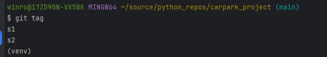
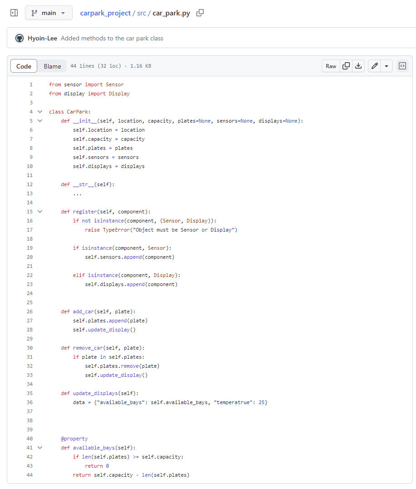
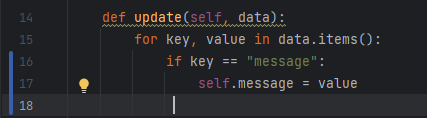

# carpark_project

This project is AT3 Project (PRJ) - V2


# This is initial commit. 


| Class Name | Attributes | Methods                          |
| ---------- | ---------- |----------------------------------|
| `CarPark`    |self.location, self.capacity | add_car, remove_car              |
| `Sensor`     |self.id, self.is_active| detect_incoming, detect_outgoing |
| `Display`    |self.id, self.message | update, show                     |


# Stubs for classes


# Tags


# Method to car park



# Answer the following questions:
> **Review Questions**
>
> 1. **Which class is responsible for each of the following pieces of information (and why)?**
>    - *The number of available bays*  
>      `CarPark class is the most responsible for storing and handling core attribute`
>    - *The current temperature*  
>      `If the carpark itself need to monitor temperature in the carpark then sensor class can take some responsibility but if the temperature means outside and temperature data is called as attribute then CarPark class takes the responsibility `
>    - *The time*  
>      `CarPark class would be the most responsible for overall time management`
>
> 2. **What is the difference between an attribute and a property?**  
>    `Attribute represents object's state and characteristics but property is like a attribute with getter, setter, and deleter method.`
>
> 3. **Why do you think we used a dictionary to hold the data we passed the display? List at least one advantage and one disadvantage of this approach.**  
>    `Dictionary allow for storing various types of data and can hold different kind of information (key-value pairs). Its flexibility enable easy modification and addition (mutable) but dictionary can not take speicific data types as a value for associated with the key`
> 
> 
> 
> 
> 
> 
# test_car_park
> 
> test_removing_a_car_that_does_not_exist failed (AssertionError: ValueError not raised)
> 
> 
> 
> Added raise ValueError
> 
> 
> 
> Error Fixed, test passed
>
# test_display
> 
> test_update failed (AssertionNotEqual)
> 
> 
> 
> Code modified
> 
> 
> Error Fixed, test passed

# Test the car park register method
```
The car park register method should accept a Sensor or Display object. 
It should raise a TypeError if the object is neither a Sensor nor a Display. 
Before proceeding, think about where you would test this behaviour. 
Should you test it in the CarPark unit tests or the Sensor unit tests? Why?

- Register method should be tested within the CarPark unit test.
The register method belongs to the CarPark class 
and is responsible for handling the registration of Sensor or Display object.
```

# test_sensor
> 


